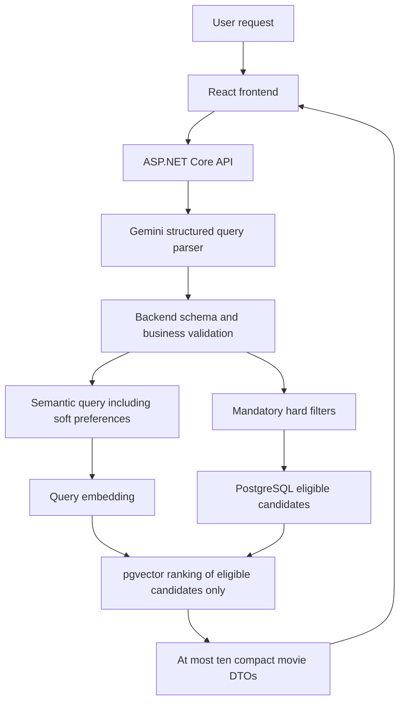

# Architecture

Status: initial design; interfaces and data-dependent schema details are not frozen.

See [technical decisions](DECISIONS.md). No application, database schema, or service implementation exists. MovieLens Tag Genome 2021 is the selected research dataset. Evaluation methodology remains pending.

## Required runtime flow

These are logical responsibilities, not mandatory separate deployment services or framework layers.

## Retrieval invariants

- A film failing any hard filter is never returned, even with the closest vector.
- Unknown metadata cannot prove a requested mandatory condition.
- Explicit constraints (for example, "at most 120 minutes") become supported structured conditions. Soft preferences ("I would prefer a shorter movie") stay semantic and do not create arbitrary boundaries.
- Backend validates model output even when it conforms to JSON Schema. Gemini never supplies the recommendation title list or executable SQL.
- One database result list is returned. There is no browser-side union of independent filter and semantic lists.
- Return 1–9 qualifying films when fewer than ten exist, with a UI notice; zero is `NO_RESULTS`. Never pad, repeat, or relax.
- Initially use exact search and cosine distance without a similarity threshold. A later threshold requires tests and a recorded decision and can only further restrict eligibility. HNSW also requires measurements.
- Use parameterized queries and stable tie-breaking. Concrete SQL/types are Phase C work.

## Responsibilities

| Component | Owns | Does not own |
| --- | --- | --- |
| Frontend | Query input, locale, loading/results/errors, IMDb navigation, accessibility | Provider secrets, parsing/filter construction, merging/reranking results |
| Backend | Request validation, parser/output validation, query embedding, search, DTOs, stable errors, sanitized diagnostics | Offline generation of all film vectors on each request |
| Query parser adapter | Fixed versioned prompt/schema and model configuration | Selecting movie titles or executing database commands |
| Embedding adapter | Model-compatible document/query embedding integration | Silently mixing model versions or dimensions |
| Search adapter | Mandatory filters and eligible-candidate ranking | Relaxing constraints to fill ten slots |
| Offline ETL | Catalog selection, mappings, provenance, TMDB cache, semantic text, resumable embeddings | Copying bulk raw reviews/ratings into runtime tables by default |
| PostgreSQL + pgvector | Compact catalog, structured retrieval, stored film vectors | Acting as a second conversational memory system |

Plan small internal parser, embedding, search, and metadata interfaces. Final signatures and DTO ownership will be reviewed in Phase A. Keep the public HTTP contract in [API_CONTRACT.md](API_CONTRACT.md).

## Offline catalog flow

After the now-completed dataset confirmation and manual download, the future pipeline is:

`local raw archive -> EDA -> glmer/tagdl decision -> compact metadata and selected tags -> cached TMDB enrichment -> approved semantic text -> offline embeddings -> application database`

Keep raw and large derived files under `database/data/`, ignored by Git. Record source hashes, observed counts, exclusions, mapping failures, chosen score representation, text template, model/dimensions, and ETL configuration. The ~9,734 scored-movie expectation must be checked rather than asserted as an imported total.

Candidate records include stable identifiers, title/year, genres/runtime/language, a documented rating source/scale, actors/directors, poster metadata, selected tags/semantic text, and one compatible embedding. Actual column types, person handling, final supported filters, and migration design await EDA. TMDB synopses are not automatically semantic research inputs.

Movie vectors are generated offline; runtime only embeds the query. Model/text configuration changes invalidate affected cached vectors explicitly. Validate one vector per movie and the selected dimensions during import.

## Local infrastructure and secrets

The intended development environment runs PostgreSQL + pgvector in Docker and frontend/backend through their development tools. Phase 0 provides only directories and instructions; Compose, schema, migrations, SDK projects, and package installations come later.

`.env.example` contains empty placeholders; Lazar creates the ignored `.env` manually. No loader exists yet. Design explicit backend-only environment loading in Phase A/D; never pass provider keys or connection secrets through Vite/client variables. Do not print keys while diagnosing setup.

TMDB outages during offline enrichment are resumable job failures. Runtime uses cached metadata; a missing/unreachable poster uses a frontend fallback. The recommendation endpoint does not depend on a new TMDB API call.

## Failure handling and evidence

Reject malformed input before provider calls. Invalid intent or unvalidated parser output stops before query embedding/search. Map throttling, confirmed quota exhaustion, outages, invalid provider output, and search failures to stable codes. Bound timeouts/retries; support cancellation and prevent old UI responses overwriting new results.

Ordinary tests use fake providers; database behavior is later verified against real PostgreSQL/pgvector with synthetic records. Record sanitized timing, configuration versions, and purposeful evaluation evidence. Research input/output protocols and metrics remain TODO until mentor confirmation.

Concrete interfaces, parser validation and catalog schema will be specified alongside the implementation. Data-dependent behavior must be explicit before enforcement.
