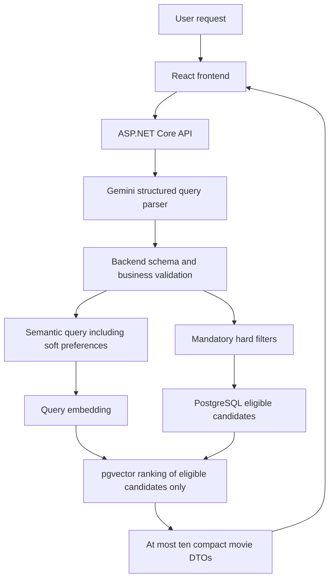

# Architecture

Status: public HTTP contract v1.0.0 frozen; internal interfaces and data-dependent schema details are not yet frozen.

See [technical decisions](DECISIONS.md). The fake-backed HTTP foundation implements the public request/response boundary; parser, search and database schema remain pending. MovieLens Tag Genome 2021 is the primary semantic source; MovieLens 32M is the approved exact-ID structured-enrichment source. Evaluation methodology remains pending.

## Required runtime flow

These are logical responsibilities, not mandatory separate deployment services or framework layers.

## Retrieval invariants

- A film failing any hard filter is never returned, even with the closest vector.
- Unknown metadata cannot prove a requested mandatory condition.
- Explicit constraints (for example, "at most 120 minutes") become supported structured conditions. Soft preferences ("I would prefer a shorter movie") stay semantic and do not create arbitrary boundaries.
- Backend validates model output even when it conforms to JSON Schema. Gemini never supplies the recommendation title list or executable SQL.
- One database result list is returned. There is no browser-side union of independent filter and semantic lists.
- Return 1–9 qualifying films when fewer than ten exist, with a UI notice; zero is `NO_RESULTS`. Never pad, repeat, or relax.
- Initially use exact search and cosine distance without a similarity threshold. A later threshold requires tests and a recorded decision and can only further restrict eligibility. HNSW also requires measurements.
- Use parameterized queries and stable tie-breaking. Concrete SQL/types are Phase C work.

## Responsibilities

| Component | Owns | Does not own |
| --- | --- | --- |
| Frontend | Query input, locale, loading/results/errors, IMDb navigation, accessibility | Provider secrets, parsing/filter construction, merging/reranking results |
| Backend | Request validation, parser/output validation, query embedding, search, DTOs, stable errors, sanitized diagnostics | Offline generation of all film vectors on each request |
| Query parser adapter | Fixed versioned prompt/schema and model configuration | Selecting movie titles or executing database commands |
| Embedding adapter | Model-compatible document/query embedding integration | Silently mixing model versions or dimensions |
| Search adapter | Mandatory filters and eligible-candidate ranking | Relaxing constraints to fill ten slots |
| Offline ETL | Catalog selection, mappings, provenance, TMDB cache, semantic text, resumable embeddings | Copying bulk raw reviews/ratings into runtime tables by default |
| PostgreSQL + pgvector | Compact catalog, structured retrieval, stored film vectors | Acting as a second conversational memory system |

Plan small internal parser, embedding, search, and metadata interfaces. Final signatures and DTO ownership will be reviewed in Phase A. Keep the public HTTP contract in [API_CONTRACT.md](API_CONTRACT.md).

## Offline catalog flow

After the completed dataset confirmation and manual download, the planned pipeline is:

`Tag Genome 2021 B1a subset + TagDL-ranked tags -> exact movieId join to MovieLens 32M genres/IDs/rating aggregates -> offline cached TMDB details by existing tmdbId -> approved semantic text -> offline embeddings -> application database`

Keep raw and large derived files under `database/data/`, ignored by Git. Record source hashes, observed counts, exclusions, mapping failures, chosen score representation, text template, model/dimensions, and ETL configuration. Source inspection found 9,734 scored movie IDs, of which 9,730 have metadata; this is an initial source intersection, not a final imported total. See the [source review](../Testiranje/reports/tag-genome-source-review.md) and [technical decisions](DECISIONS.md).

Candidate records include stable identifiers, title/year, nullable ML32M genres and rating aggregates, nullable TMDB runtime/language/poster details, the B1a rating, raw actors/directors, selected tags/semantic text, and one compatible embedding. The TagDL top-ten rule and semantic text are fixed in [SEMANTIC_CATALOG.md](SEMANTIC_CATALOG.md); current offline enrichment is fixed in [ENRICHMENT_V2.md](ENRICHMENT_V2.md). Final supported filters, parsed person identity semantics, database column types and migration design remain open. TMDB synopses and other TMDB prose are excluded from semantic text.

Movie vectors are generated offline; runtime only embeds the query. Model/text configuration changes invalidate affected cached vectors explicitly. Validate one vector per movie and the selected dimensions during import.

## Local infrastructure and secrets

The intended development environment runs PostgreSQL + pgvector in Docker and frontend/backend through their development tools. Phase 0 provided only directories and instructions; Compose, schema and migrations come in their assigned implementation phases. The fake-backed API SDK project and tests now exist; the approved project/toolchain foundation is in [TOOLCHAIN.md](TOOLCHAIN.md).

### Environment and deployment target (plan only)

| Environment | Frontend | Backend | Database |
| --- | --- | --- | --- |
| Local | React/Vite local development server | ASP.NET Core local process | PostgreSQL + pgvector in Docker with a persistent volume |
| Production target | Vercel | ASP.NET Core Docker container on Koyeb Free, Frankfurt | Supabase PostgreSQL + pgvector |

The same migrations, schema and catalog-import concept should work in both environments. The backend will select Development/Production configuration through the standard .NET environment mechanism; the frontend will use separate development/production API base URL configuration. A later `start_script.cmd` change should check/start the local Docker database before starting backend and frontend. Secrets must never be committed or exposed through frontend configuration. This is a target, not authorization to implement or deploy production infrastructure; provider feasibility and operational details remain subject to their later package.

Future Koyeb backend note: add a lightweight `GET /health` endpoint returning `200 OK` and a minimal response, without database or provider access unless a separate deep health check is explicitly designed. Lazar reports that Koyeb Free currently scales to zero after one hour without incoming traffic; recheck the then-current Free terms and acceptable-use rules before production deployment and measure actual cold-start latency. An external uptime/health scheduler calling `/health` may be considered later only as an optional optimization to reduce cold starts. No 50-minute interval or keep-alive policy is selected now. If measured cold start is acceptable, prefer natural scale-to-zero. This note authorizes neither deployment nor an external scheduler.

`.env.example` contains empty placeholders; Lazar creates the ignored `.env` manually. No loader exists yet. Design explicit backend-only environment loading in Phase A/D; never pass provider keys or connection secrets through Vite/client variables. Do not print keys while diagnosing setup.

TMDB outages during offline enrichment are resumable job failures. Runtime uses cached metadata; a missing/unreachable poster uses a frontend fallback. The recommendation endpoint does not depend on a new TMDB API call.

## Failure handling and evidence

Reject malformed input before provider calls. Invalid intent or unvalidated parser output stops before query embedding/search. Map throttling, confirmed quota exhaustion, outages, invalid provider output, and search failures to stable codes. Bound timeouts/retries; support cancellation and prevent old UI responses overwriting new results.

Ordinary tests use fake providers; database behavior is later verified against real PostgreSQL/pgvector with synthetic records. Record sanitized timing, configuration versions, and purposeful evaluation evidence. Research input/output protocols and metrics remain TODO until mentor confirmation.

Concrete interfaces, parser validation and catalog schema will be specified alongside the implementation. Data-dependent behavior must be explicit before enforcement.
